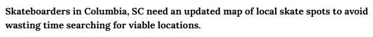

<!DOCTYPE html>
<html>
	<head>
		<title> CSCE 190: Robert Baily</title>
		<link> rel="stylesheet" href="styles.css"</link>
	</head>
	<body>
		<h1>Ranger Klauk</h1>
		

			<h2>About me</h2>
			
“To leave any person happier than they were before my impact on them, socially or professionally.”

		

		

			<h2>Skills</h2>
		

		

			<h2>Highlighted projects</h2>
		

		

			<h2>Contact me</h2>
		

		

			<section class="project">
			<a href="files/statement.pdf"><h3>Problem Statement</h3></a>
			
			
One sentence to describe your problem

			</section>
			

	</body>
</html>