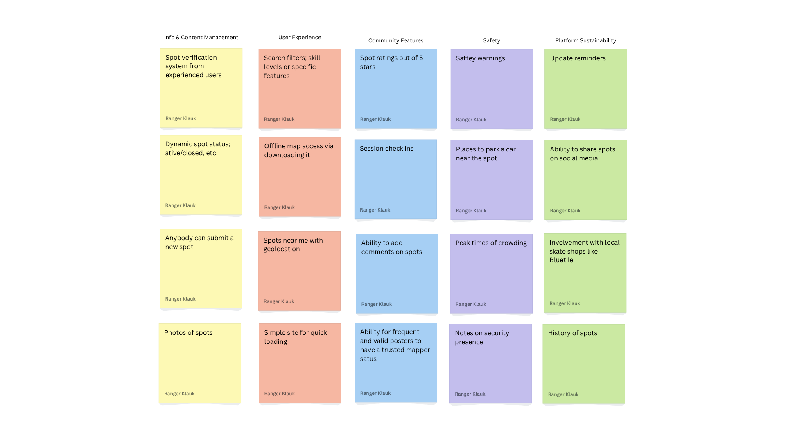

<!DOCTYPE html>
<html lang="en">
<head>
    <meta charset="UTF-8">
    <meta name="viewport" content="width=device-width, initial-scale=1.0">
    <title>CSCE 190: Ranger Klauk</title>
    <link rel="stylesheet" href="styles.css">
    <link rel="stylesheet" href="https://cdnjs.cloudflare.com/ajax/libs/font-awesome/6.4.0/css/all.min.css">
</head>
<body>
    <nav class="main-nav">
        

            <a href="index.html" class="nav-logo">Ranger Klauk</a>
            

                <a href="index.html">Home</a>
                <a href="resume.html">Resume</a>
                <a href="gitFiles/resume.pdf" target="_blank">Resume PDF</a>
            

        

    </nav>
    

        <header>
            <h1>RANGER KLAUK</h1>
            
Computer Science Student | Future Software Developer

            

                <i class="fas fa-envelope"></i> rangerklauk@gmail.com
                <i class="fas fa-phone"></i> (803) 463-1725
                <i class="fas fa-map-marker-alt"></i> Chapin, SC 29036
            

        </header>
        

            

                <h2><i class="fas fa-file-alt"></i> My Resume</h2>
                
View my complete professional background, education, skills, and experience.

                

                    <a href="resume.html" class="preview-btn primary">
                        <i class="fas fa-eye"></i> View Online Resume
                    </a>
                    <a href="resume.pdf" class="preview-btn secondary" target="_blank">
                        <i class="fas fa-download"></i> Download PDF Resume
                    </a>
                

            

        

        

            <h2>About Me</h2>
            
"To leave any person happier than they were before my impact on them, socially or professionally."

        

        

            <section class="project">
                <a href="gitFiles/statement.pdf">
                    
                    

                        <h3>Problem Statement</h3>
                        
Skateboarders in Columbia, SC need an updated map of local skate spots to avoid wasting time searching for viable locations.

                    

                </a>
            </section>
            <section class="project">
                <a href="gitFiles/affinityDiagram.pdf">
                    
                    

                        <h3>Affinity Diagram</h3>
                        
Above is an affinity diagram showcasing ideas for improving the skateboarding experience in Columbia.

                    

                </a>
            </section>
            <section class="project">
                <a href="gitFiles/ColaSkateSpots Full Sketch.pdf">
                    
                    

                        <h3>Sketches</h3>
                        
This is a layout of my website to be created, with dedicated home, search, and spot pages with information.

                    

                </a>
            </section>
        

        

            <h2>Contact Me</h2>
            

                <a href="mailto:rangerklauk@gmail.com" class="contact-btn">
                    <i class="fas fa-envelope"></i> Email
                </a>
                <a href="tel:8034631725" class="contact-btn">
                    <i class="fas fa-phone"></i> Call
                </a>
            

        

        <footer>
            
&copy; 2024 Ranger Klauk | CSCE 190 Portfolio

        </footer>
    

</body>
</html>

<!--Deepseek helped create some of this code>
